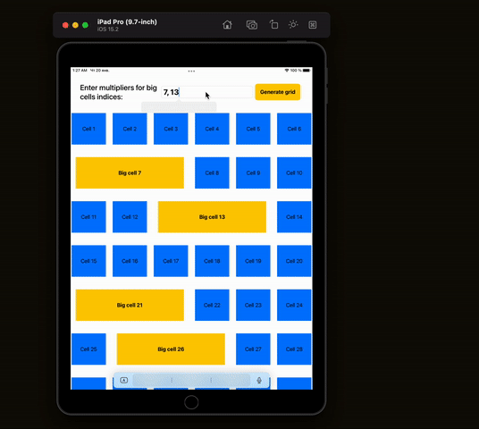

# Working with SwiftUI grids

    
    

Test project with demo working with cells in SwiftUI.

LazyVGrid does not have a column span feature. This tutorial demonstrate how we could implement it this easily.

